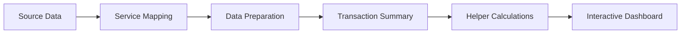

# Easy Laundry – Business Performance Dashboard

## Project Overview

The **Easy Laundry Business Performance Dashboard** is a formula-driven Excel portfolio project built to transform raw laundry transaction records into a clear and interactive management report.

The workbook analyzes business performance across **8,078 service line items** and **6,333 unique transactions** recorded from **January 2025 to June 2026**. It helps a business owner monitor revenue, transaction activity, customer participation, service contribution, recorded discounts, promotional impact, and weekday operating patterns from a single dashboard.

Customer names were replaced with anonymous customer IDs during data preparation to protect personal privacy while preserving the analytical value of the dataset.

## Business Problem

The original application export was not ready for direct analysis because:

- A single transaction could contain several service lines.
- Service names were inconsistent and overly detailed.
- Kilogram-based, item-based, package, partner, and delivery services used different measurement logic.
- Several types of discounts and promotions appeared in the same dataset.
- Counting raw rows would overstate the actual number of transactions.
- Customer information had to be protected before the project could be published.

This project solves those problems by preserving the raw source data, creating a standardized preparation layer, and building a one-row-per-transaction summary for reliable reporting.

## Dataset Summary

| Item | Description |
|---|---|
| Industry | Laundry Service / Small Business |
| Reporting period | January 2025 – June 2026 |
| Coverage | 18 months |
| Service line items | 8,078 rows |
| Unique transactions | 6,333 |
| Active customers | 647 anonymized customers |
| Original services mapped | 95 service records |
| Data granularity | Service line-item and transaction-summary levels |
| Main tool | Microsoft Excel |

> **Privacy note:** Customer names in the source data were anonymized into labels such as `Customer_001`, `Customer_002`, and so on. No real customer names are presented in the analytical or dashboard sheets.

## Dashboard KPIs

The dashboard presents six primary KPIs:

1. **Net Revenue** – revenue remaining after recorded discounts and promotions.
2. **Transaction Count** – number of unique transactions, not the number of service rows.
3. **Average Order Value** – Net Revenue divided by Transaction Count.
4. **Active Customers** – number of unique anonymized customers in the selected period.
5. **Total Weight** – total kilogram-based laundry workload.
6. **Total Items** – total item-based laundry quantity.

For the complete reporting period, the dashboard summarizes approximately:

| KPI | Result |
|---|---:|
| Net Revenue | Rp307.2M |
| Transaction Count | 6,333 |
| Average Order Value | Rp48.5K |
| Active Customers | 647 |
| Total Weight | 26,310.7 kg |
| Total Items | 4,803 |

## Dashboard Analysis

### 1. Net Revenue by Service Mix

A horizontal bar chart compares service contribution based on either:

- **Service Category**, or
- **Service Type**

The user can switch between both views through a dashboard control. The results and chart title update dynamically.

### 2. Monthly Business Performance

A combo chart displays:

- Monthly Net Revenue as columns
- Monthly Transaction Count as a line

This view helps distinguish revenue changes caused by transaction volume from changes in average order value or service mix.

### 3. Recorded Adjustments and Promotions

A Waterfall chart reconciles:

`Listed Service Value − Recorded Adjustments and Promotions = Net Revenue`

It separates the effect of:

- Early Payment Discount
- Standard Price Adjustment
- Wednesday Promotion

### 4. Average Daily Performance by Weekday

A weekday combo chart compares:

- Average Daily Revenue
- Average Daily Transactions

Daily results are calculated first and then averaged by weekday. This prevents weekdays with more calendar occurrences from appearing artificially stronger.

## Dashboard Interactivity

The workbook includes two Form Control Combo Boxes:

- **Reporting Period:** `All Period`, `2025`, or `2026`
- **Service View:** `Service Category` or `Service Type`

The selected reporting period updates the KPI cards and analytical charts. The Service View selector changes the grouping used in the Service Mix analysis.

## Data Preparation Workflow



The main preparation steps were:

- Preserved the original application export for traceability.
- Extracted valid transaction dates from transaction IDs.
- Replaced customer names with anonymous customer aliases.
- Retained original service descriptions for auditability.
- Standardized service names with a dedicated mapping table.
- Grouped services into simplified Service Category and Service Type dimensions.
- Classified Partner Status and Unit Type.
- Separated kilogram-based workload from item-based workload.
- Classified payment adjustments, discounts, and promotional records.
- Calculated Net Revenue.
- Aggregated multiple service rows into one transaction-summary record.
- Added weekday, month, month-start, and year dimensions.
- Built dynamic helper tables for KPI and chart calculations.

## Workbook Structure

| Sheet | Purpose |
|---|---|
| Dashboard Guide | Explains controls, metrics, chart interpretation, and reporting limitations |
| Dashboard | Presents the interactive one-screen business report |
| Source Data | Preserves the original application export |
| Service Mapping | Standardizes original service descriptions |
| Data Preparation | Cleans, classifies, and enriches service line-item data |
| Transaction Summary | Creates one reliable record for each unique transaction |
| Calculation / Helper Sheets | Supports KPIs, filters, and dynamic chart ranges |

## Excel Features and Functions

### Excel Features

- Excel Tables and structured references
- Form Control Combo Boxes
- Dynamic-array formulas
- Named ranges
- KPI cards
- Dynamic chart titles
- Combo column-and-line charts
- Horizontal bar chart
- Waterfall chart
- Secondary axes
- Custom currency, weight, and item number formats
- One-screen dashboard layout
- Dashboard documentation

### Main Functions

`SUMIFS`, `COUNTIFS`, `XLOOKUP`, `IF`, `IFS`, `IFERROR`, `INDEX`, `UNIQUE`, `FILTER`, `SORT`, `AVERAGEIF`, `DATE`, `YEAR`, `MONTH`, `WEEKDAY`, and `TEXT`

The dashboard is primarily **formula-driven**. PivotTables are not used as its main calculation engine.

## Business Questions Answered

- How much Net Revenue was generated during the selected period?
- How many unique transactions and customers were active?
- What was the Average Order Value?
- Which Service Categories or Service Types contributed the most revenue?
- How did revenue and transaction activity change each month?
- How much Listed Service Value was reduced by recorded adjustments and promotions?
- Which weekdays generated the highest average daily revenue and transactions?
- How much kilogram-based and item-based workload was processed?

## Key Reporting Notes

- **Net Revenue is not profit.** COGS and operating expenses were not available, so the project does not measure Gross Profit or Net Profit.
- **2026 is a partial year.** It covers January through June and should not be compared directly with the full 2025 period as if both were complete years.
- The dashboard reports recorded promotional and adjustment activity but does not claim that a promotion alone caused a performance change.
- Some operational adjustments for long-term customers were intentionally flexible and were preserved as part of the historical business context.

## Skills Demonstrated

- Excel dashboard development
- Formula-based business reporting
- Data cleaning and standardization
- Service-name mapping with XLOOKUP
- Transaction-level data modeling
- Duplicate-count prevention
- Dynamic KPI calculation
- Dynamic-array reporting
- Monthly trend analysis
- Customer and service analysis
- Discount and promotion reporting
- Weekday operational analysis
- Excel data visualization
- Data anonymization and privacy-aware reporting

## Repository Contents

```text
Easy-Laundry-Business-Performance-Dashboard/
├── Easy Laundry - Business Performance Dashboard.xlsx
└── README.md
```

## Project Scope

This project is designed as evidence of practical Excel skills for:

- Business performance dashboards
- Small-business management reports
- Transaction analysis
- Revenue analysis
- Operational reporting
- Data cleaning and mapping
- Formula-driven Excel reporting

It does not include VBA, Power Query, Power Pivot, SQL, Python, Power BI, external database connections, or automated data refresh.

---

**Portfolio project by Dimas Bagus Putra Sejati**
